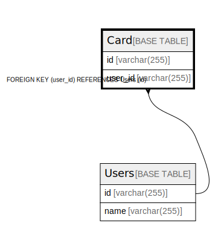

# Card

## Description

<details>
<summary><strong>Table Definition</strong></summary>

```sql
CREATE TABLE `Card` (
  `id` varchar(255) NOT NULL,
  `user_id` varchar(255) NOT NULL,
  PRIMARY KEY (`id`),
  KEY `user_id` (`user_id`),
  CONSTRAINT `Card_ibfk_1` FOREIGN KEY (`user_id`) REFERENCES `Users` (`id`) ON DELETE RESTRICT ON UPDATE RESTRICT
) ENGINE=InnoDB DEFAULT CHARSET=utf8mb4 COLLATE=utf8mb4_0900_ai_ci
```

</details>

## Columns

| Name | Type | Default | Nullable | Children | Parents | Comment |
| ---- | ---- | ------- | -------- | -------- | ------- | ------- |
| id | varchar(255) |  | false |  |  |  |
| user_id | varchar(255) |  | false |  | [Users](Users.md) |  |

## Constraints

| Name | Type | Definition |
| ---- | ---- | ---------- |
| Card_ibfk_1 | FOREIGN KEY | FOREIGN KEY (user_id) REFERENCES Users (id) |
| PRIMARY | PRIMARY KEY | PRIMARY KEY (id) |

## Indexes

| Name | Definition |
| ---- | ---------- |
| user_id | KEY user_id (user_id) USING BTREE |
| PRIMARY | PRIMARY KEY (id) USING BTREE |

## Relations



---

> Generated by [tbls](https://github.com/k1LoW/tbls)
